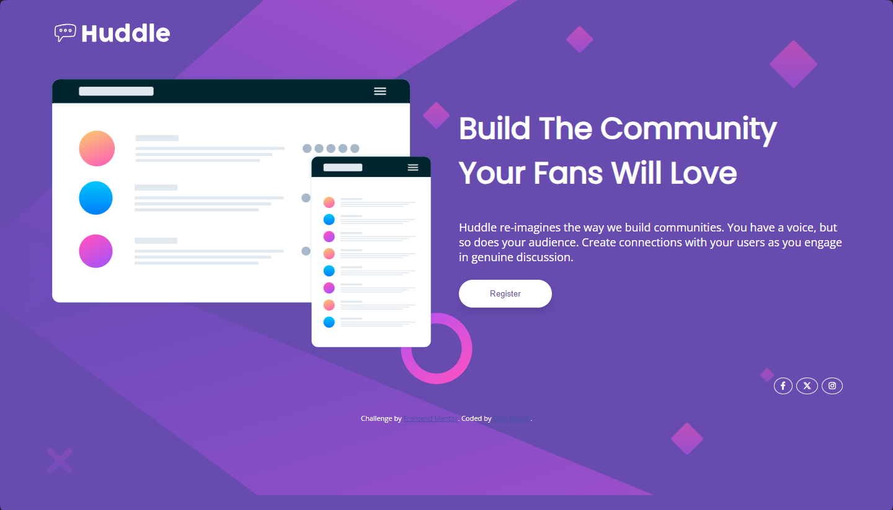
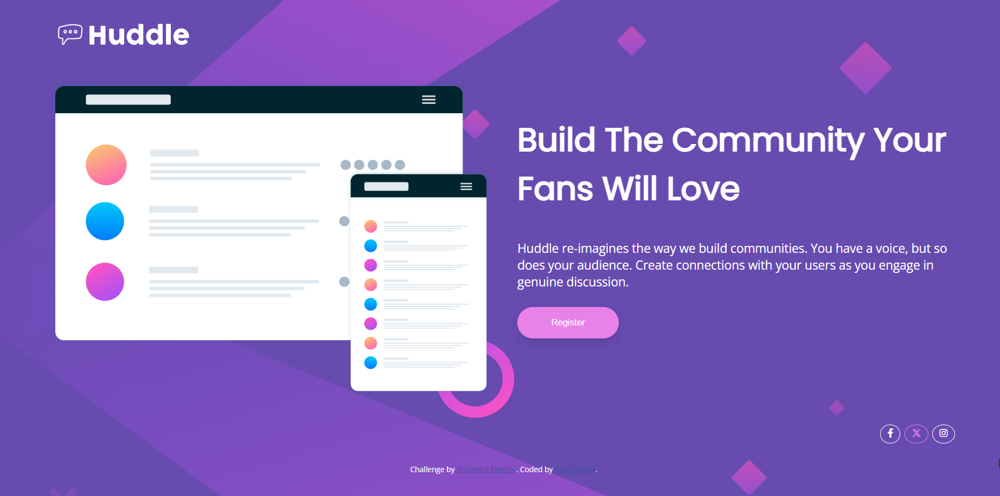

# Frontend Mentor - Huddle landing page with single introductory section solution

This is a solution to the [Huddle landing page with single introductory section challenge on Frontend Mentor](https://www.frontendmentor.io/challenges/huddle-landing-page-with-a-single-introductory-section-B_2Wvxgi0). Frontend Mentor challenges help you improve your coding skills by building realistic projects.

## Table of contents

- [Overview](#overview)
  - [The challenge](#the-challenge)
  - [Screenshot](#screenshot)
  - [Links](#links)
- [My process](#my-process)
  - [Built with](#built-with)
  - [What I learned](#what-i-learned)
  - [Continued development](#continued-development)
  - [Useful resources](#useful-resources)
- [Author](#author)

## Overview

### The challenge

Users should be able to:

- View the optimal layout for the page depending on their device's screen size
- See hover states for all interactive elements on the page

### Screenshot



### Links

- Solution URL: [Link](https://github.com/EmirBakkal0/huddle-landing-page-with-single-introductory-section)
- Live Site URL: [Link](https://emirbakkal0.github.io/huddle-landing-page-with-single-introductory-section/)

## My process

### Built with

- Semantic HTML5 markup
- CSS custom properties
- Flexbox
- CSS Grid
- Mobile-first workflow

### What I learned

I learned about mobile first workflow by using @media tags

```css
@media screen and (max-width:375px) {
  /* mobile only classes here */
}
```

Learned about layouts

```css
 @media only screen and (min-width: 375px) and (max-width:1440px){
  /* For desktop: */
  [class*="col-"]{
    padding: 20px;
  }
  .col-1 {width: 8.33%;}
  .col-2 {width: 16.66%;}
  .col-3 {width: 25%;}
  .col-4 {width: 33.33%;}
  .col-5 {width: 41.66%;}
  .col-6 {width: 50%;}
  .col-7 {width: 58.33%;}
  .col-8 {width: 66.66%;}
  .col-9 {width: 75%;}
  .col-10 {width: 83.33%;}
  .col-11 {width: 91.66%;}
  .col-12 {width: 100%;}
 }
```

### Continued development

I want to focus on responsive design and flex box when working on future projects. I am still not completely comfortable on some aspects.

### Useful resources

- [W3 Schools CSS Responsive Web Design](https://www.w3schools.com/css/css_rwd_intro.asp) - This site helped me to learn about the responsive web designs.


## Author

- Website - Emir Bakkal
- Frontend Mentor - [@EmirBakkal0](https://www.frontendmentor.io/profile/EmirBakkal0)
